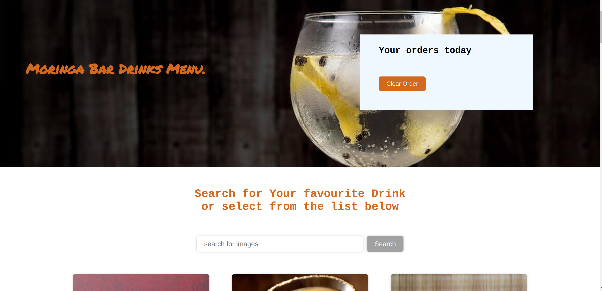
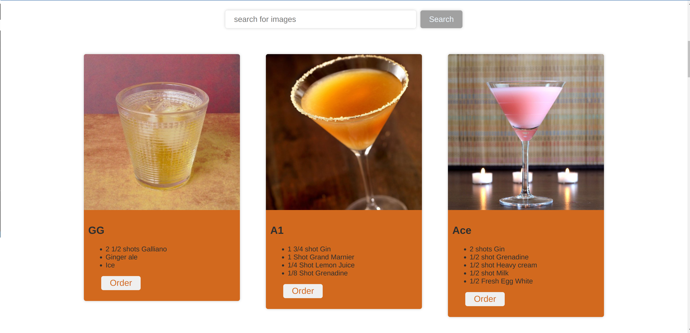
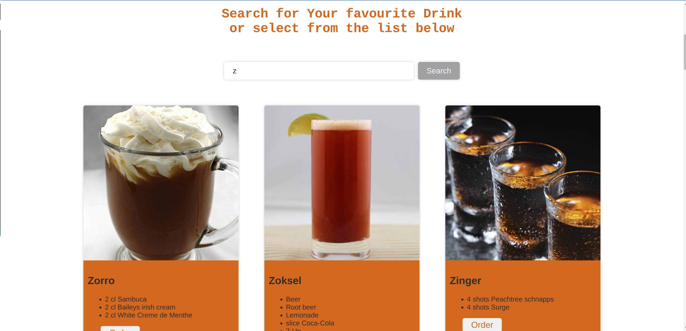
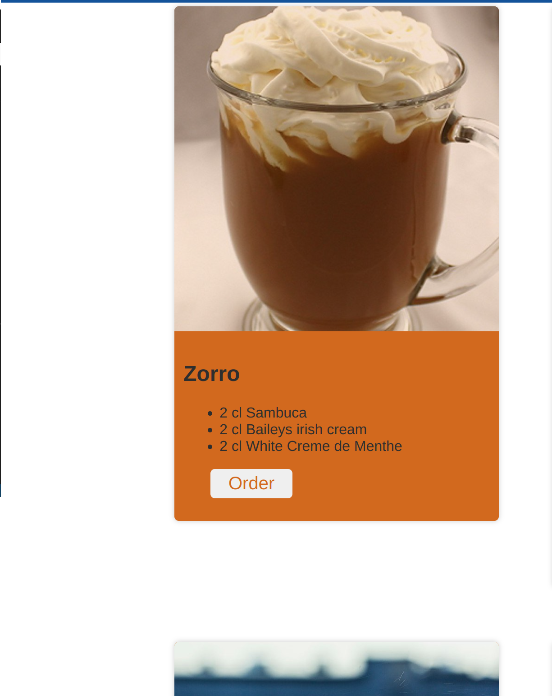
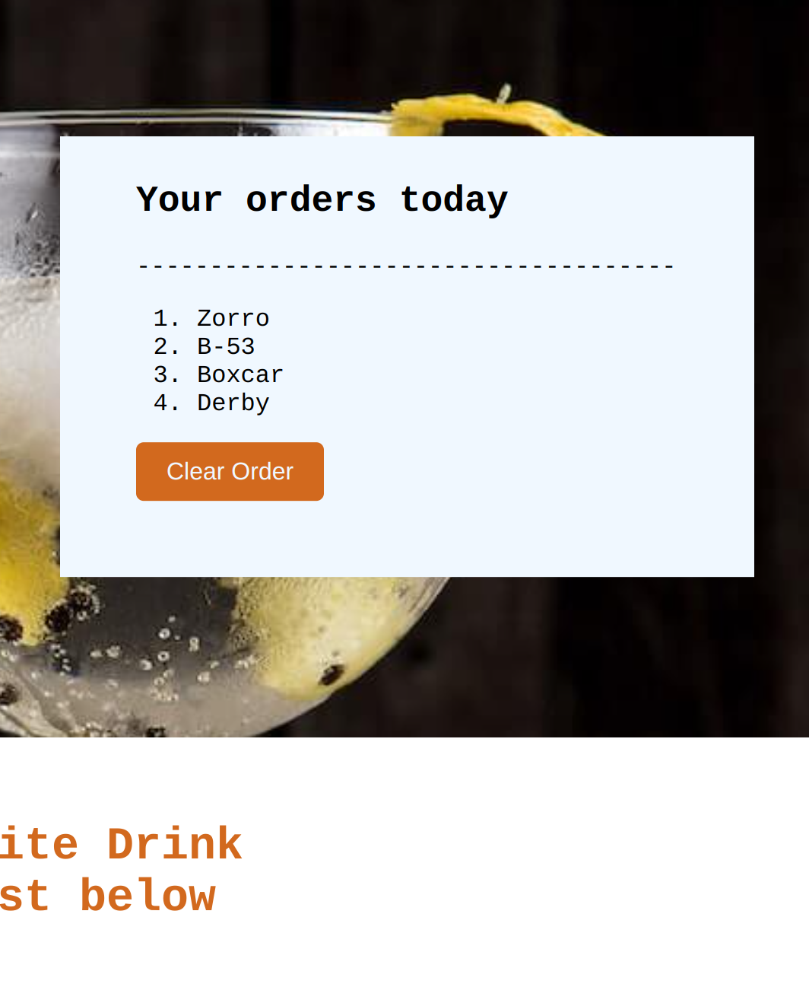
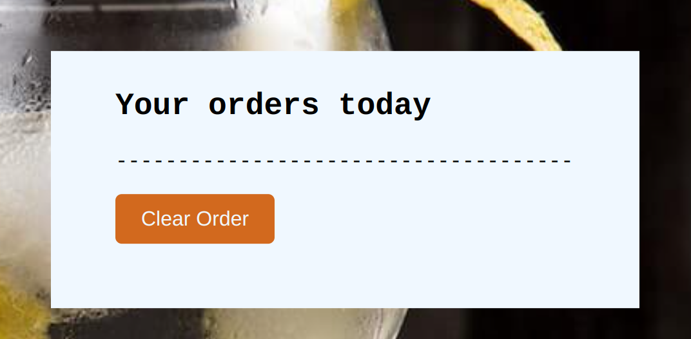

# Phase1-Independent-Project

#### Moringa After 4 Pub - Drinks ordering app

#### Created By Brian Baraza on 05-07-2023

## Deployment Link

https://brianbaraza23.github.io/Phase1-Independent-Project/

## Description

The Cocktail ordering app is designed to allow clients at the pub to see a list of cocktails available. This digitized system allows patrons to place their orders directly from the app, thus eliminating the need for them to come into contact with physical menus, which may be contaminated during disease outbreaks such as the one witnessed during the COVID-19 outbreak or even the common cold season. The app also makes the process of ordering drinks more efficient as patrons can complete this task through their phones.

## Client Requirements

The client for this project is "Moringa After 4 Pub", a tech-savvy establishment that aims to rejuvenate developers and satisfy their thirst after a day of coding. As the majority of their clientele consists of programmers, the owner decided to "speak their language" and digitize as many manual tasks as possible, starting with the cocktail menu.

## Setup Requirements

Since the app utilizes an online public API, no further installations are required. Once deployed online, all that a user will need is a device with internet access and browser. By simply clicking on the provided URL, they will be directed straight to the menu.

## Current Version

- Version: v1.0

- Description: This is the first version of a much larger final app, at this point the app aims to achieve:

             1. Cocktail List: The app will display a list of available cocktails available for order
             2. Ordering: The app allows users to easily order their desired drinks by simply clicking the order button, which populates the order list.

## Technologies Used (v1.0)

- HTML
- CSS
- javascript
- Adobe illustrator

## API (v1.0)

- The free JSON API named TheCocktailDB has been used in this phase of the project
- API Link: www.thecocktaildb.com/api/json/v1/1/search.php?f=a

## Future Expansion

This is an ongoing project, not just of a cocktail ordering app, but also has the potential to become a national drinking statistics data collection tool and a lucrative advertising revenue generator. The developer has expressed interest in adding additional features to enhance its functionality, in later versions of the project. Some of the features being consiered for future implementation include:

    1.Drink Alert System: An alert system will be incorporated to calculate the number of drinks a patron has consumed during a single sitting. The system will issue warnings to the patron when they are approaching the legal "drink-drive" limit, triggering an alert after 3 drinks. After 5 drinks, the system will advise the patron to avoid driving and consider taking a cab. Furthermore, the app will discourage the user from ordering more drinks after the 8th drink.

    2.User Accounts: Each user will have a unique account, providing their demographic details such as age, weight, BMI, and existing medical conditions. These details will create unique user profiles accessible through individual log-in credentials. Privacy & anonymity might be important to some users, at this point, thus the system will generate a unique Identification numbers for each user and not share their names to the data base. This feature enables the app to track and aggregate the number of drinks a user has consumed in a month. If a user's drink intake exceeds the recommended limit for their demographic, the app will provide health advice regarding their drinking habits. Additionally, the app may recommend the user to seek medical assistance from professionals advertising on the app, such as doctors, psychologists, and nutritionists.

    3.Reporting to Government Authorities: By tracking monthly consumption for each user, the system can provide valuable statistics on alcohol consumption. These reports can be shared with relevant government authorities such as NACADA (National Authority for the Campaign Against Alcohol and Drug Abuse), NTSA (National Transport and Safety Authority), or the Ministry of Health. The app can recommend that all alcohol purchases, whether from liquor stores, bars, or restaurants, require users to use their unique account I.Ds and receive monthly reports on their drinking habits. This will enable the government to gather statistical data on alcohol consumption, discourage heavy drinkers through targeted campaigns, and potentially generate revenue from advertising.

    4.Advertising Opportunities: With mandatory account I.D usage for purchasing drinks, advertisers targeting this niche market can leverage the platform. Doctors, anti-drinking campaigners, and alcoholic beverage sellers can push their advertisements through the app, reaching a well-defined audience. Advertising revenue can be shared between the developers and the responsible government agency (e.g., NACADA, Ministry of Health, or NTSA) on a 50/50 basis.

    5.Statistical Data Revenue: Beverage sellers, ranging from large-scale companies such as Diageo, EBL, and Keroche Breweries to small-scale vendors like pubs, restaurants, and liquor stores, can purchase valuable statistical data from the app. This data includes demographic details, dates & times of purchase, and locations of their customers. This Valuable insights into their customer base, will allow them to make better informed decisions when planning their marketing & sales strategy thus optimize their operations.

## User instructions & Screenshots

- step1: 
  Enter link of deployed app on your browser

  link ---> https://brianbaraza23.github.io/Phase1-Independent-Project/

  

- Step2 a: 
  a list of available drinks is automaticaly displayed when the DOM Loads. users can select their favourite cocktail form the list

 

- Step2 b: 
  alternatively users can filter the cocktail list by typing the first letters of the cocktail name in the provided search box

  

- Step3: 
  Upon identifying their favourite cocktail, users can click the order button to submit their order.

  

- Step4: 
  Clicking the order button will add the cocktail to the list of orders a drinker has made in a session

  

- Step5: 
  A session can be cleared by clicking the reset button thus emptying the list

  

## Known Bugs

At this phase of the project the key requirements seem to be working fine

## License

Copyright (c) 2023 Brian Baraza

Please note that this is an ongoing project, and all the ideas presented in this document are the intellectual property of the developer. Any individual or entity intending to; further develop, collaborate on, or share the ideas presented should first obtain permission from the developer.

THE SOFTWARE IS PROVIDED "AS IS," WITHOUT WARRANTY OF ANY KIND, EXPRESS OR IMPLIED, INCLUDING BUT NOT LIMITED TO THE WARRANTIES OF MERCHANTABILITY, FITNESS FOR A PARTICULAR PURPOSE, AND NONINFRINGEMENT. IN NO EVENT SHALL THE AUTHORS OR COPYRIGHT HOLDERS BE LIABLE FOR ANY CLAIM, DAMAGES, OR OTHER LIABILITY, WHETHER IN AN ACTION OF CONTRACT, TORT, OR OTHERWISE, ARISING FROM, OUT OF, OR IN CONNECTION WITH THE SOFTWARE OR THE USE OR OTHER DEALINGS IN THE SOFTWARE.

## Support and contact details

- For further information or support regarding the program, please contact the developer via email.

- Email: brian.baraza@moringaschool.com

